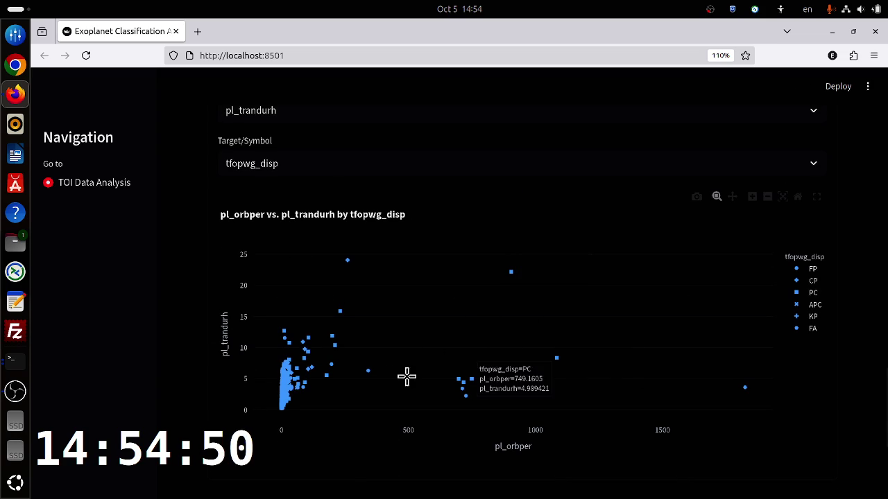

# Fast Classify Exoplanet

(Team Whitespace 2025 for SpaceApp 2025)
Welcome to our project! We are amateurs passionate about exoplanet detection and we’re open to suggestions. Our goal is to collaborate and learn with others who share the same interest in exoplanet detection.

## Presentation

[Link to Presentation]()

## Summary

For astronomy amateurs, classifying exoplanet candidates from raw telescopic data can be a daunting task. This project aims to bridge that gap by providing accessible machine learning tools to distinguish promising signals from noise. We started with data from two key NASA missions: the Kepler Object of Interest (KOI) and the TESS Object of Interest (TOI) catalogs.

Our approach involves using the powerful XGBoost algorithm to train classification models on this data. We've developed separate models for KOI and TOI data, achieving respectable baseline accuracy. More importantly, we've wrapped the entire workflow into an interactive web application using Streamlit. This UI allows users to load data, visualize features, train a model, and interpret the results using SHAP (SHapley Additive exPlanations), making the complex process of machine learning more intuitive and transparent.

- Two models for KOI and TOI Exoplanet Detection are provided.
    - Simple baseline on TOI test set: Accuracy:  0.8169, Precision: 0.7773, Recall: 0.8371
    - Simple baseline on KOI test set: Accuracy:  0.8796, Precision: 0.9039, Recall: 0.9018

- An interactive Streamlit web application for classifying exoplanet candidates from TESS Object of Interest (TOI) data.
    - This tool provides a simple, step-by-step user interface to walk through the entire machine learning workflow: from loading and visualizing data to training a model, running inference, and interpreting the results.

## Results for KOI and ROI


## Key Features of Web Applications

This demo shows the application running at 2× speed.
[](https://github.com/user-attachments/assets/e14ab151-ac11-4c5f-bcd7-ccccd5b0b1f0)

*   **Interactive Web Interface**: A user-friendly, browser-based application for the entire classification process.
*   **Flexible Data Input**: Upload your own CSV data or use the sample TOI files included in the project.
*   **Data Exploration**: Interactively visualize data distributions and feature relationships with 1D and 2D plots.
*   **Guided Workflow**: Follow a clear, numbered sequence of steps:
    1.  Data Loading
    2.  Header Information Review
    3.  Train/Test Splitting
    4.  Data Visualization
    5.  Feature Selection
    6.  Data Filtering
    7.  Binary Target Creation
    8.  XGBoost Model Training with Cross-Validation
    9.  Inference on Test Data
    10. Model Interpretation with SHAP Plots
*   **Customizable Training**: Tune XGBoost hyperparameters directly in the UI before running the training.


## Q and A

**Q: What's this project for?**

A: We wanted to make it easier for astronomy enthusiasts to get their hands dirty with exoplanet classification. This project provides tools to work with real NASA data without needing a deep machine learning background.

**Q: What's the difference between KOI and TOI data?**

A: They're both catalogs of potential exoplanet candidates, just from different space telescopes. KOI is from the Kepler mission, and TOI is from the TESS mission. We've trained separate models for each dataset.

**Q: Why use the XGBoost model?**

A: For this kind of classification task on tabular data, XGBoost is a well-regarded algorithm that performs reliably. It's a great starting point for building a solid classifier.

**Q: What does the Web App do?**

A: It's an interactive tool we built with Streamlit that walks you through the whole process: loading data, picking features, training a model, and seeing the results. You can even upload your own datasets to play around with.

**Q: How do I know *why* the model made a certain prediction?**

A: We've integrated SHAP analysis plots. These charts show you which data features (like orbital period or transit depth) had the biggest impact on the model's decision to classify a candidate as a "yes" or "no".

**Q: What was your development workflow like?**

A: We took a script-based approach. First, we explored the raw data to understand its structure. Then, we wrote separate Python scripts for each step: splitting the data, selecting features, training the model with cross-validation, and scoring the results. This modular approach made it easy to experiment. Finally, we built the Streamlit UI on top of these scripts to create an interactive experience.

**Q: What's missing or planned for the future?**

A: This is just a baseline! The biggest missing piece is incorporating light curve data, which is the raw brightness-over-time signal. We plan to explore models that can analyze light curves directly, likely using neural networks (CNNs or LSTMs). We also want to add more advanced data visualization features to the web app and continue to fine-tune the models for better performance.

## Installation

1.  Clone the repository:
    ```bash
    git clone https://github.com/tungtylee/fast-classify-exoplanet.git
    cd fast-classify-exoplanet
    ```
2.  Create and activate a virtual environment:
    ```bash
    python3 -m venv venv
    source venv/bin/activate
    ```
3.  Install the dependencies:
    ```bash
    pip install -r requirements.txt
    ```

## Usage (Web App)

To start the interactive web application, run the following command from the project's root directory:

```bash
streamlit run main.py
```

A new tab should open in your web browser. Simply follow the numbered steps in the application to proceed through the workflow.

## Advanced Usage (Command-Line)

For advanced users who prefer to work with command-line tools or wish to understand the underlying data processing scripts in more detail, comprehensive documentation is available.

Please refer to the **[data_TOI/README_TOI.md](data_TOI/README_TOI.md)** file for a complete guide to the individual Python scripts, their parameters, and example workflows.

## Data

The data used in this project is from the NASA Kepler Object of Interest (KOI) and TESS Object of Interest (TOI) catalogs. Sample data files are included in the `data_KOI/datas/` and `data_TOI/data/` directories, respectively.

## AI Usage Declaration

In the spirit of transparency, we want to acknowledge the use of AI in this project. AI-powered tools were occasionally used to assist in the development of small scripts and code snippets. Furthermore, AI was utilized to help draft, refine, and format parts of the documentation, including this README file.

## Contributing

Contributions are welcome! Please open an issue or submit a pull request.

## License

This project is licensed under the MIT License.

## References

### Data Sources & Missions
- **Kepler KOI datasets:** [Link](https://exoplanetarchive.ipac.caltech.edu/cgi-bin/TblView/nph-tblView?app=ExoTbls&config=cumulative)
- **TESS TOI datasets:** [Link](https://exoplanetarchive.ipac.caltech.edu/cgi-bin/TblView/nph-tblView?app=ExoTbls&config=TOI)

### Further Reading
- **[BRITE_NTHU]** Searching for Possible Exoplanet Transits from BRITE Data through a Machine Learning Technique: [arXiv:2012.10035](https://arxiv.org/abs/2012.10035)
- **[ExpDet]** Exoplanet detection using machine learning: [MNRAS](https://academic.oup.com/mnras/article/513/4/5505/6472249)
- **[EnsembleML]** Assessment of Ensemble-Based Machine Learning Algorithms for Exoplanet Identification: [MDPI](https://www.mdpi.com/2079-9292/13/19/3950)
- **[Yu2020]** Rapid classification of TESS planet candidates with convolutional neural networks: [A&A](https://www.aanda.org/articles/aa/pdf/2020/01/aa35345-19.pdf)

### Software & Libraries
- **Streamlit:** [Documentation](https://docs.streamlit.io/)
- **XGBoost:** [Documentation](https://xgboost.readthedocs.io/en/stable/)
- **SHAP:** [Documentation](https://shap.readthedocs.io/en/latest/)