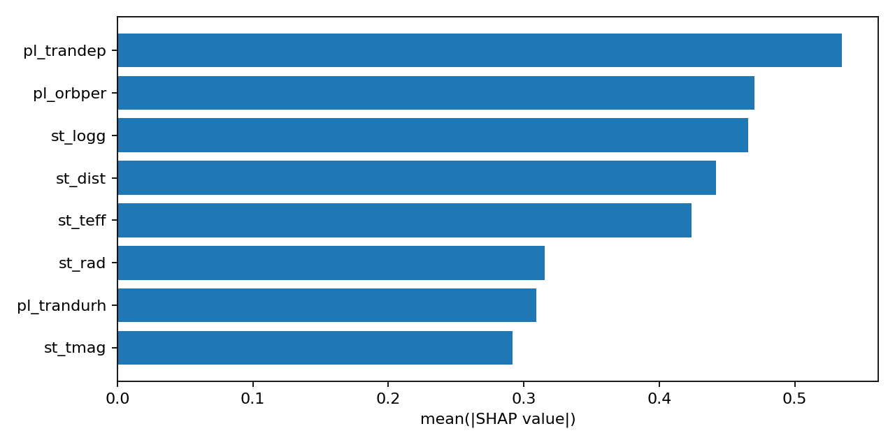
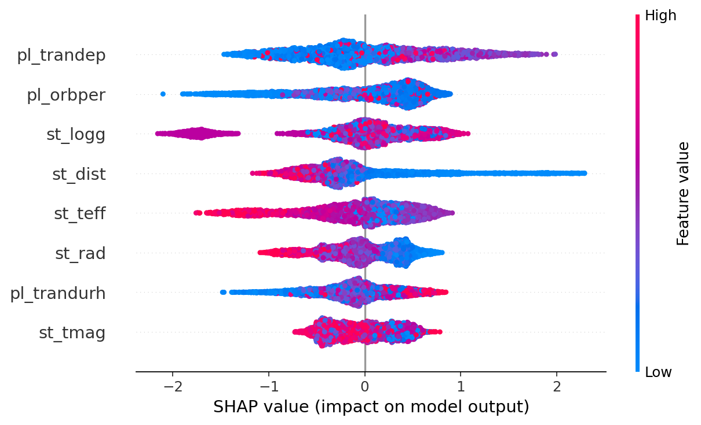
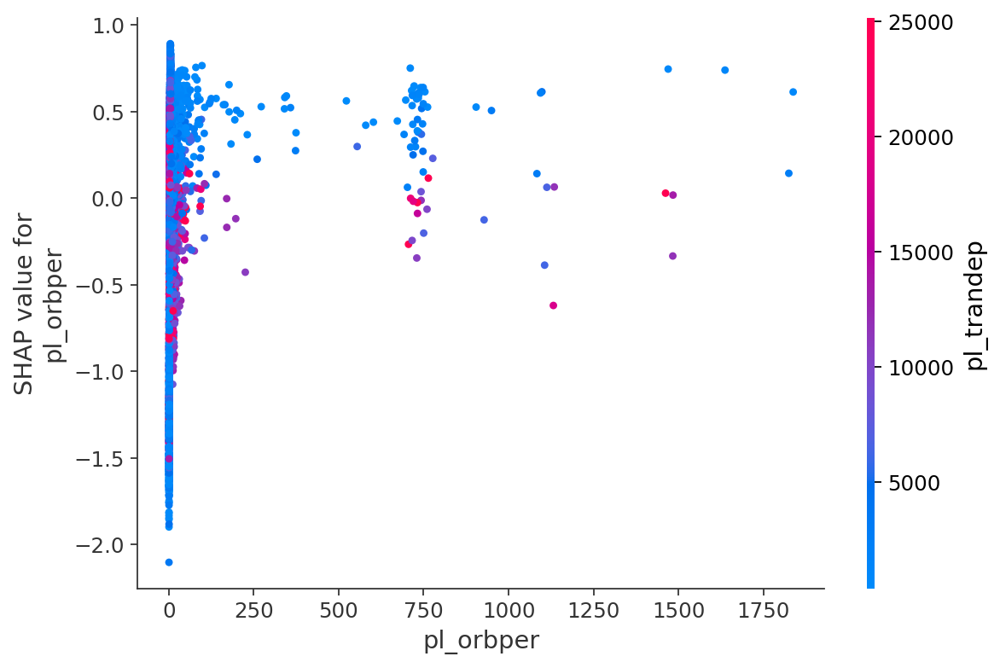
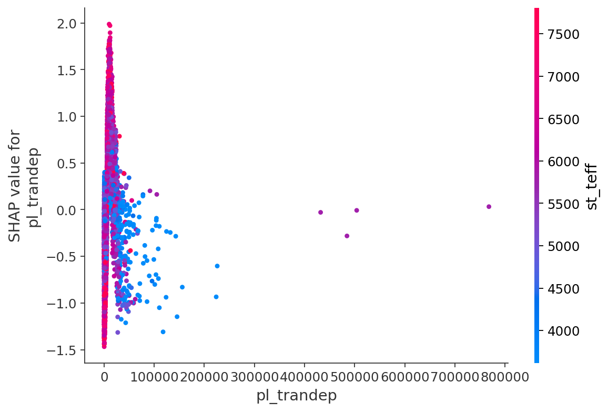
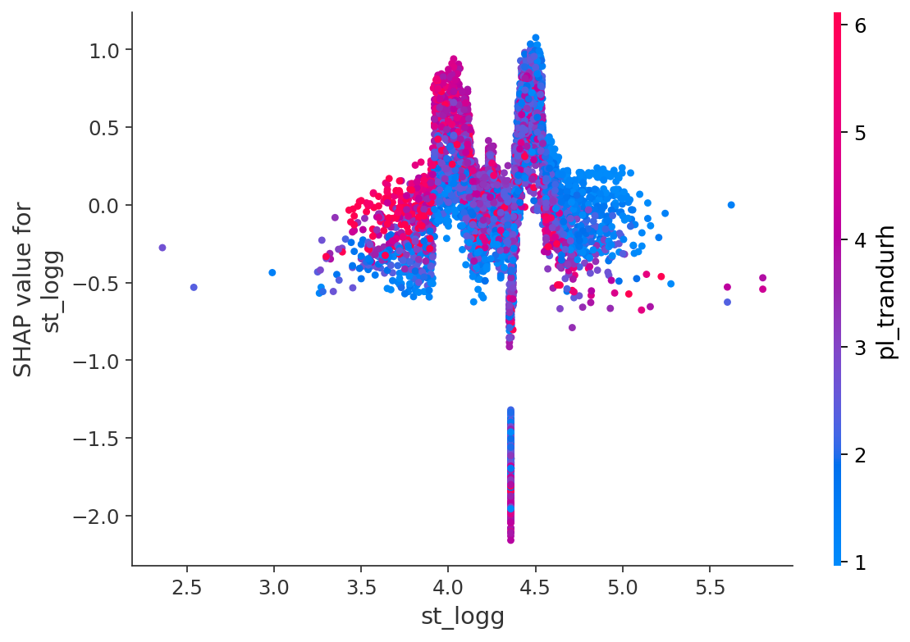

# TOI Data Processing Scripts

This directory contains scripts for processing and filtering data related to TESS Objects of Interest (TOI).

## Results

### SHAP Analysis

SHAP (SHapley Additive exPlanations) values help us understand the output of our XGBoost model. They explain how each feature contributes to a prediction. The following plots were generated by `shap_report.py`.

#### Feature Importance Bar Plot

This plot shows the average impact of each feature on the model's output magnitude. The features are ranked by their importance. This tells us which features are most influential overall.



#### Beeswarm Summary Plot

The beeswarm plot provides more detail than the bar plot. Each dot is a single prediction for a single data point.
-   **Feature Value:** The color of the dot shows whether the feature's value for that data point was high (red) or low (blue).
-   **SHAP Value (x-axis):** The position of the dot on the x-axis shows how much that feature's value pushed the model's output for that specific prediction. Positive SHAP values push the prediction towards "Positive Planet Candidate," while negative values push it towards "Negative."
-   **Density:** The dots stack up to show the distribution of SHAP values for each feature.

This plot is great for seeing not just *which* features are important, but also *how* their values affect the predictions. For example, we can see if high values of a feature consistently lead to positive or negative predictions.



#### Dependence Plots

Dependence plots show how a single feature's value affects its SHAP value across all data points. This helps us understand the relationship between a feature's value and its contribution to the prediction. The script generates these for the top 3 most important features.

**1. Orbital Period (`pl_orbper`)**

This plot shows the relationship between the planet's orbital period and the model's prediction.



**2. Transit Depth (`pl_trandep`)**

This plot shows how the transit depth (the change in star brightness) influences the prediction.



**3. Stellar Surface Gravity (`st_logg`)**

This plot shows the effect of the star's surface gravity on the prediction.



### Results on TOI test_set
```
--- Scoring Results ---
Scored on column: 'tfopwg_disp'
Total items matched by ID 'toi': 1547
Total items scored (after 'dontcare' filter): 486
Ignored items: 1061

--- Confusion Matrix ---
                  | Predicted Positive | Predicted Negative
------------------------------------------------------------
Actual Positive   |     185   (TP)     |      36   (FN)    
Actual Negative   |      53   (FP)     |     212   (TN)    

--- Metrics ---
Accuracy:  0.8169
Precision: 0.7773
Recall:    0.8371
F1-Score:  0.8061
```


### Results on TOI cross validation

```json
auc,acc,f1,precision,recall,fold
0.9129218677762369,0.8197115384615384,0.8251748251748252,0.8082191780821918,0.8428571428571429,1.0
0.9098109351047521,0.8385542168674699,0.8416075650118203,0.8317757009345794,0.8516746411483254,2.0
0.8830073860733033,0.7951807228915663,0.8089887640449438,0.7627118644067796,0.861244019138756,3.0
0.8981047057184002,0.8265060240963855,0.8356164383561644,0.7991266375545851,0.8755980861244019,4.0
0.894179402610675,0.8265060240963855,0.8333333333333334,0.8071748878923767,0.861244019138756,5.0
0.8996048594566736,0.8212917052826691,0.8289441851842174,0.8018016537741024,0.8585235816814765,3.0
```

### Reproducing the Results

The following commands show how to reproduce the inference results, scoring, and SHAP analysis plots presented above, using the pre-trained model.

```bash
## The model has been trained and is available in the ckpt/ directory.
## This command shows how it was originally trained.
# python train_xgb_toi_cv.py \
#   --config scorer_conf.json \
#   --train_csv data/train_set_binary.csv \
#   --inference_csv data/test_set_filtered.csv \
#   --out_csv results/test_set_pred.csv \
#   --feats "pl_orbper,pl_trandurh,pl_trandep,st_teff,st_logg,st_rad,st_tmag,st_dist" \
#   --n_estimators 300 --learning_rate 0.05 --max_depth 4 \
#   --subsample 0.8 --colsample_bytree 0.8 --min_child_weight 5 \
#   --reg_lambda 5.0 --reg_alpha 0.0 \
#   --balance auto --seed 42 \
#   --cv --folds 5 --eval_metric auc \
#   --model_out ckpt/xgb_2025-10-04-rerun.joblib

# 1. Run inference with the pre-trained model
python infer_xgb_toi.py \
  --model ckpt/xgb_2025-10-04.joblib \
  --inference_csv data/test_set_filtered.csv \
  --out_csv results/test_set_pred_2025-10-04.csv \
  --threshold 0.5

# 2. Score the predictions against the ground truth
python score_model.py data/test_set_filtered.csv results/test_set_pred_2025-10-04.csv

# 3. Generate SHAP analysis plots
python shap_report.py \
  --model xgb_model.joblib \
  --train_csv data/train_set_filtered.csv \
  --id_column toi --target_column tfopwg_disp \
  --out_prefix shapout/shap_xgb
```

## Scripts

All scripts should be run from within the `data_TOI` directory.

### 1. `split_data.py`

This script splits the source TOI CSV data into `train_set.csv` and `test_set.csv`. It ensures that all data points for a single star (tid) belong to the same set (either training or testing).

**Usage:**

```bash
# Run with default arguments
python split_data.py

# Or provide a specific input file and output directory
python split_data.py [source_csv_path] [output_dir_path]
```

**Defaults:**
- Source CSV: `data/TOI_2025.10.03_22.49.45.csv`
- Output Directory: `data`

### 2. `interactive_filter.py`

This script allows you to interactively select columns to keep from a CSV file. It will go through each column one by one, show you a summary, and ask if you want to keep it. The names of the columns you "pick" are saved to a text file.

**Usage:**
```bash
python interactive_filter.py [input_csv_path] [output_columns_file]
```

**Example:**
```bash
python interactive_filter.py data/train_set.csv data/selected_columns.txt
```

### 3. `filter_csv.py`

This script filters a CSV file, keeping only the columns specified in a column file (like the one generated by `interactive_filter.py`). It creates a new, smaller CSV file.

**Usage:**
```bash
python filter_csv.py [input_csv_path] [columns_file_path] [output_filtered_csv]
```

**Example:**
```bash
python filter_csv.py data/train_set.csv data/selected_columns.txt data/train_set_filtered.csv
```

### 4. `filterout_dontcare.py`

This script filters a CSV file to remove rows that are marked as "dontcare" in the `scorer_conf.json` file. This is useful for creating a binary classification dataset (positive/negative) from data that includes other classifications.

**Usage:**
```bash
python filterout_dontcare.py [input_csv_path] [output_binary_csv]
```

**Example:**
```bash
python filterout_dontcare.py data/train_set.csv data/train_set_binary.csv
```

### 5. `analyze_column.py`

This script provides a detailed analysis of each column in a CSV file. It shows the data type, missing value counts, and statistical summaries for numeric columns or value distributions for categorical columns.

**Usage:**

To analyze all columns:
```bash
python analyze_column.py [input_csv_path]
```

To analyze only the columns that contain missing values, use the `--missing-only` flag:
```bash
python analyze_column.py [input_csv_path] --missing-only
```

*Note: Initial analysis shows that the `st_dist`, `st_teff`, `st_logg`, and `st_rad` columns contain missing values.*

### 6. `score_model.py`

This script compares a prediction CSV file against a ground truth (GT) CSV file to evaluate model performance. It uses a JSON configuration file to determine which columns to use for scoring and how to map values to 'positive', 'negative', or 'dontcare'. It calculates and displays a confusion matrix, accuracy, precision, recall, and F1-score.

**Note:** A default `scorer_conf.json` is provided in this directory.

**Usage:**
```bash
# The config file is optional and defaults to 'scorer_conf.json' in the current directory
python score_model.py <path_to_gt.csv> <path_to_pred.csv> [path_to_config.json]
```

**Example:**
```bash
# Compare a prediction file against the training set using the default config
python score_model.py data/train_set.csv data/train_set_pred.csv
```

### 7. `train_xgb_toi_cv.py`

This script trains an XGBoost classifier on the TOI data. It supports cross-validation to find the best model. The labels ('positive', 'negative', 'dontcare') are determined by the `scorer_conf.json` file. It takes a training CSV, performs training, and then runs inference on a specified inference CSV, saving the predictions. The trained model is saved to a `.joblib` file.

**Usage:**
```bash
python train_xgb_toi_cv.py \
  --config scorer_conf.json \
  --train_csv data/train_set_binary.csv \
  --inference_csv data/test_set_filtered.csv \
  --out_csv data/test_set_pred.csv \
  --model_out xgb_model.joblib \
  --cv --folds 5
```

### 8. `infer_xgb_toi.py`

This script runs inference using a pre-trained XGBoost model. It loads a saved `.joblib` model and applies it to a CSV file, saving the predictions to a new CSV file.

**Usage:**
```bash
python infer_xgb_toi.py \
  --model <path_to_model.joblib> \
  --inference_csv <path_to_inference_data.csv> \
  --out_csv <path_to_output_predictions.csv>
```

**Example:**
```bash
python infer_xgb_toi.py \
  --model ckpt/xgb_2025-10-04.joblib \
  --inference_csv data/test_set_filtered.csv \
  --out_csv results/test_set_pred.csv
```

### 9. `shap_report.py`

This script generates SHAP (SHapley Additive exPlanations) reports to help interpret a trained model. It loads a saved model and uses a dataset to create several outputs: a feature importance CSV, a feature importance bar plot, a SHAP beeswarm plot, and dependence plots for the most important features.

**Usage:**
```bash
python shap_report.py \
  --model xgb_model.joblib \
  --train_csv data/train_set_filtered.csv \
  --out_prefix shapout/shap_xgb
```

## Example Workflow

This workflow demonstrates a complete process from training a model to evaluating it and generating interpretation reports.

```bash
# 1. Train the XGBoost model with 5-fold cross-validation
# This uses the binary training set and outputs predictions for the filtered test set.
# The best model from CV is saved.
python train_xgb_toi_cv.py \
  --config scorer_conf.json \
  --train_csv data/train_set_binary.csv \
  --inference_csv data/test_set_filtered.csv \
  --out_csv data/test_set_pred.csv \
  --n_estimators 300 --learning_rate 0.05 --max_depth 4 \
  --subsample 0.8 --colsample_bytree 0.8 --min_child_weight 5 \
  --reg_lambda 5.0 --reg_alpha 0.0 \
  --balance auto \
  --cv --folds 5 --eval_metric auc

# 2. Score the model's predictions against the ground truth
python score_model.py data/test_set_filtered.csv data/test_set_pred.csv

# 3. Create a directory for SHAP reports
mkdir shapout

# 4. Generate SHAP reports to interpret the model
python shap_report.py \
  --model xgb_model.joblib \
  --train_csv data/train_set_filtered.csv \
  --id_column toi --target_column tfopwg_disp \
  --out_prefix shapout/shap_xgb
```

## Data Source

- **NASA Exoplanet Archive**: [TESS Objects of Interest (TOI) Table](https://exoplanetarchive.ipac.caltech.edu/cgi-bin/TblView/nph-tblView?app=ExoTbls&config=TOI)